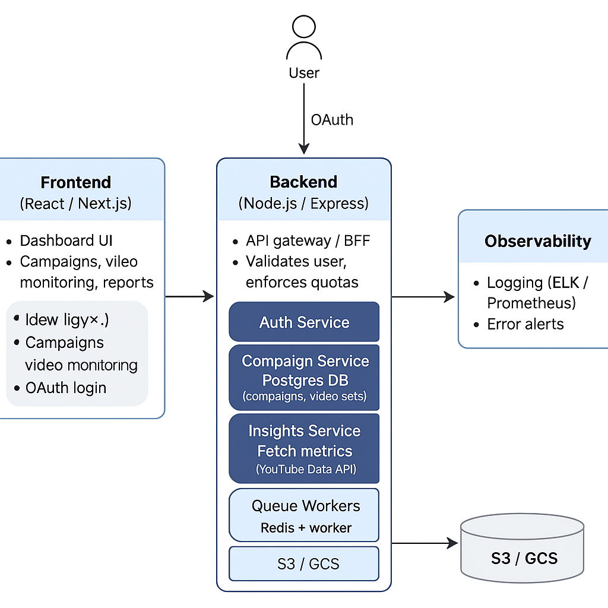

#  YouTube Bot — Automate Views, Likes, Comments & Subscriptions

  

  
  

---

## Overview
The **YouTube Bot** is a scalable automation system that simulates real human behavior across multiple Google accounts.  
It’s designed for **views, likes, comments, and subscriptions** — all with **safe pacing, proxy handling, and customizable ratios**.

Features:
- View automation with watch time controls  
- Like & dislike simulation with ratios  
- Comment automation with spintax/randomization  
- Auto-subscribe/unsubscribe flows  
- Proxy & fingerprint handling (Multilogin integration)  
- Multi-account scaling (10 → 1000+)  

---

##  Target Audience
This project is built for:
- Growth hackers & marketers testing campaigns  
- Indie creators looking for traffic attribution insights  
- Developers exploring browser automation at scale  

---

## Architecture

  

## Features

| # | Feature        | Description                                                                 |
|---|---------------|-----------------------------------------------------------------------------|
| 1 | **Views**     | Automates YouTube views with search-based attribution, sidebar clicks, shorts, and trending tab browsing. |
| 2 | **Likes/Dislikes** | Human-like ratios with randomized engagement actions for safe automation. |
| 3 | **Comments**  | Spintax/randomized comments for varied, safe, human-like comment posting.   |
| 4 | **Subscriptions** | Auto-subscribe/unsubscribe with configurable pacing and account safety.  |
| 5 | **Scaling**   | Multi-account session handling with proxies and fingerprint isolation.      |
| 6 | **Dashboard** | Control panel for campaigns, logs, error tracking, and performance reports. |

---

##  Contact
- 💬 [Discord](https://discord.gg/vBu9huKBvy)  
- 📱 [Telegram](https://t.me/devpilot1)

---

